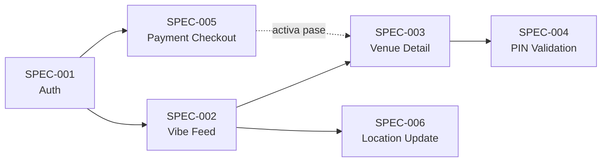

# Menbresia AI — Spec Index (MVP)

> Documento índice de todas las especificaciones para el desarrollo del MVP.  
> Cada funcionalidad es una historia de usuario independiente con resultado visual validable.

---

## Mapa de Funcionalidades



---

## Resumen de Specs

| ID | Funcionalidad | Carpeta | Descripción | Día |
|----|---------------|---------|-------------|-----|
| SPEC-001 | **Autenticación** | [`auth/`](./auth/) | Login con Google Sign-In + persistencia de sesión | Día 1 |
| SPEC-002 | **Vibe Feed** | [`venue-feed/`](./venue-feed/) | Feed vertical de locales con imágenes, distancia GPS y beneficios | Día 1-2 |
| SPEC-003 | **Venue Detail** | [`venue-detail/`](./venue-detail/) | Detalle del local con geofencing y botón de activación | Día 2-3 |
| SPEC-004 | **PIN Validation** | [`pin-validation/`](./pin-validation/) | Merchant PIN pad + pantalla "PASS ACTIVE!" con countdown | Día 3 |
| SPEC-005 | **Payment Checkout** | [`payment-checkout/`](./payment-checkout/) | Selección de plan + Checkout Yape/Plin + subida de comprobante | Día 4 |
| SPEC-006 | **Location Update** | [`location-update/`](./location-update/) | Bottom sheet de actualización manual de ubicación desde el feed | Día 5 |

---

## Estructura de Archivos
```
MVP-MenbresiaAI/spec/
├── README.md           ← Este archivo
├── auth/
│   ├── spec.md         ← Historia de usuario + criterios de aceptación
│   ├── plan.md         ← Diseño técnico + archivos a crear
│   └── tasks.md        ← Tareas desglosadas con resultado visual
├── venue-feed/
│   ├── spec.md
│   ├── plan.md
│   └── tasks.md
├── venue-detail/
│   ├── spec.md
│   ├── plan.md
│   └── tasks.md
├── pin-validation/
│   ├── spec.md
│   ├── plan.md
│   └── tasks.md
├── payment-checkout/
│   ├── spec.md
│   ├── plan.md
│   └── tasks.md
└── location-update/
    ├── spec.md
    ├── plan.md
    └── tasks.md
```

---

## Grafo de Dependencias

| Spec | Depende de |
|------|------------|
| SPEC-001 (Auth) | Ninguna (base) |
| SPEC-002 (Vibe Feed) | SPEC-001 (usuario autenticado) |
| SPEC-003 (Venue Detail) | SPEC-002 (navegación desde feed) |
| SPEC-004 (PIN Validation) | SPEC-003 (navegación desde detalle) |
| SPEC-005 (Payment Checkout) | SPEC-001 (userId para registro) |
| SPEC-006 (Location Update) | SPEC-002 (feed renderizado con VenueOverlay) |

> **Nota:** SPEC-005 (Payment) es independiente del flujo Feed → Detail → PIN.
> SPEC-006 (Location Update) es una mejora incremental de SPEC-002 y sus 3 historias pueden desarrollarse en paralelo entre sí.

---

## Convenciones
- Cada `spec.md` contiene: Historia de Usuario, Alcance, Criterios de Aceptación, Diseño de Referencia y Dependencias.
- Cada `plan.md` contiene: Enfoque técnico por capas (Data, Domain, Presentation), flujo de datos y archivos a crear.
- Cada `tasks.md` contiene: Tareas numeradas con checkboxes, resultado visual esperado por tarea, y definición de "Done".
- Las tareas siguen la nomenclatura `T-XXX.Y` donde `XXX` = ID de spec, `Y` = número de tarea secuencial.
